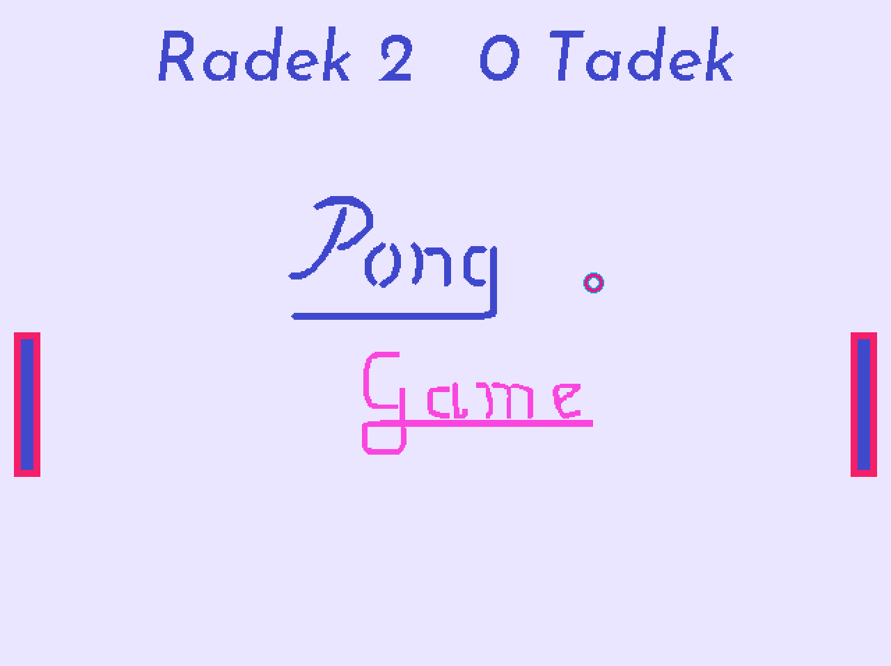

# Pong Game
> Classic game made in SDL2!

## General info
There are two players, one ball and a match to win. First who score 11 points wins. Graphics is 100% Paint. :)
Aim was to do the simpliest game to learn programming.

## Screenshots

## Technologies
* C++11
* SDL 2.0

## Status
Project is _suspended_. In the next version maybe there will be limited time of the match.

## Inspiration
Classic arcade game Pong and the colours from Miami Vice.
